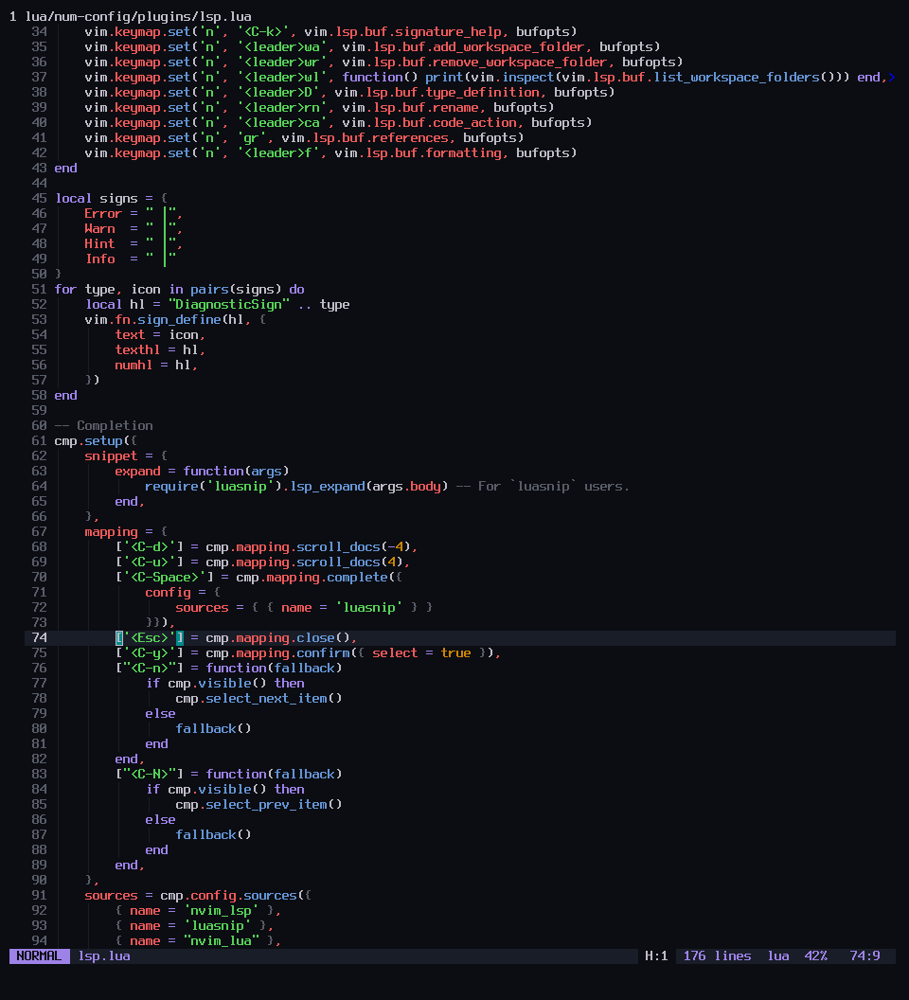

# tonight.nvim 🌙

Tonight is a dark colour scheme for [Neovim](https://github.com/neovim/neovim)
written in Lua with [Tomorrow Dark](https://github.com/chriskempson/base16-tomorrow-scheme) and
[Spacegray](https://github.com/ackyshake/Spacegray.vim) in mind.

## Screenshots




## Why?

I made it because the aforementioned colour schemes are great but quite dim and
unappealing to look at over long periods of time. The main idea is to look at a
colour and know instantly what it is *every single time* without the mental
overhead of staring at it too long. This, for me, does that.

Also I wanted an excuse to learn Lua :^).

## Features

- Easy on the eyes for long periods of time
- **Lualine** theme.
- **Supports LSP**.
- Treesitter support for the most part. More support is gradually being added
  over time.

## Installation & Usage

### Install

[packer](https://github.com/wbthomason/packer.nvim)

```lua
use 'redshifttt/tonight.nvim'
```

### Enabling the colourscheme

lua:

```lua
vim.cmd.colorscheme("tonight")
```

#### Lualine

If you use Lualine then you can you can set the theme in your config:

```lua
require('lualine').setup{
    options = {
        theme = "tonight"
    },
}
```

**It is highly recommended that you customise your Lualine colours for your own setup instead of using defaults!**
